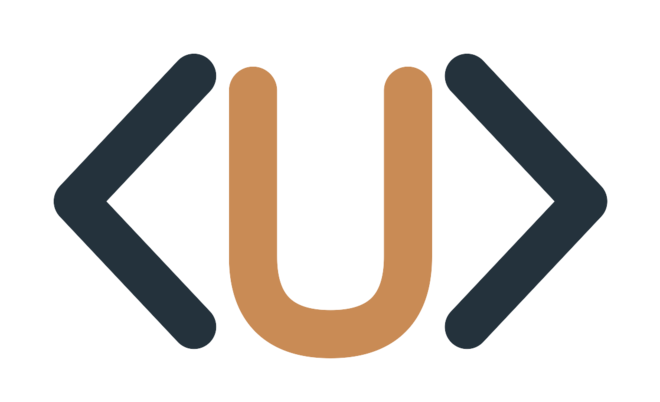

  

# umka-beaf

🇬🇧 English (this file) · 🇷🇺 [Русский](README.ru.md)

---

15+ years in IT — started in engineering-design automation (CAD, electrical
systems), then moved through development, DevOps, tech lead and CTO roles
across a few industries: construction/architecture, BIM consulting, lead
generation. Currently at the intersection of AI engineering and
infrastructure: RAG systems, analytics, self-hosted enterprise services.

Public open source is new territory for me — I used to only write articles;
now I'm starting to publish the tools themselves.

 — full picture in the CV below.

### What I work on

- Infrastructure: Docker/Kubernetes, self-hosted services, CI/CD, IaC
- AI engineering: RAG, LLM integrations, analytics on top of ClickHouse/Kafka
- Low-code automation: n8n (AI agents, monitoring)
- Enterprise architecture: ArchiMate, BPM, systems documentation

### Elsewhere

🇷🇺 

🇷🇺 

Pinned repositories below are the current, always-up-to-date snapshot of
what I'm building.
